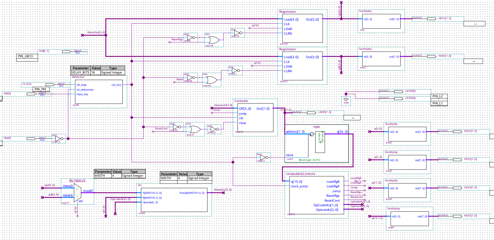

# LabSD CPU
This project implements a barebones CPU for a Cyclone-V FPGA board. Made for a university discipline in quartus using verilog everywhere the professor allowed us to.

Some of the capabilities of this CPU are:
* 8 bit Program counter with soft and hard reset
* immediate jumps
* two 4 bit general purpose registers
* ALU operations based on an operand and stored register values
* 256*16 bytes RO instruction data (each instruction is 16 bits, so 256 instructions)
* GPR and PC display as hexadecimal numbers.

Some CPU components and simulations asked for assignments can be viewed at imgs/. Aside from that, here is the CPU full picture:

